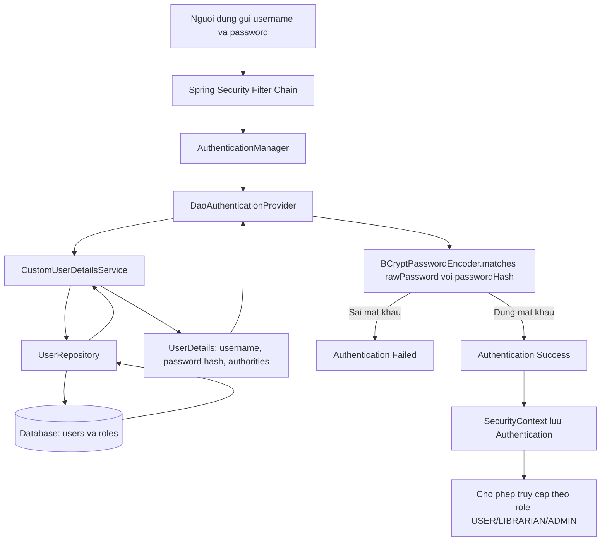

# PHAN TICH: QUAN LY NGUOI DUNG THU VIEN

## Xay dung CustomUserDetailsService va PasswordEncoder

### Boi canh

He thong quan ly thu vien so cua EduLibrary Corp da co co so du lieu `users`
voi cac truong quan trong nhu `username`, `password` va `roles`. Trong do,
`password` duoc luu o dang da ma hoa/hash. Tuy nhien, co che xac thuc hien tai
van su dung tai khoan cau hinh cung trong bo nho hoac co che ma hoa mat khau
khong an toan.

Dieu nay lam cho he thong thieu linh hoat trong quan ly nguoi dung va tao ra
rui ro bao mat nghiem trong. Giai phap phu hop la tich hop Spring Security voi
database thong qua `CustomUserDetailsService`, dong thoi su dung
`BCryptPasswordEncoder` de kiem tra mat khau an toan.

---

## Phan 1 - Phan tich logic

### 1. Vai tro cua UserDetailsService

`UserDetailsService` la mot interface quan trong trong Spring Security, co nhiem
vu tai thong tin nguoi dung dua tren `username`. Khi nguoi dung thuc hien dang
nhap, Spring Security se goi phuong thuc:

```java
loadUserByUsername(String username)
```

Phuong thuc nay tra ve mot doi tuong `UserDetails`, chua cac thong tin can thiet
cho qua trinh xac thuc va phan quyen:

- `username`: ten dang nhap cua nguoi dung.
- `password`: mat khau da duoc hash trong database.
- `authorities`: danh sach quyen hoac vai tro cua nguoi dung.
- Trang thai tai khoan: bi khoa, het han, bi vo hieu hoa hoac con hieu luc.

Trong bai toan quan ly thu vien, `CustomUserDetailsService` se truy van database
de lay thong tin nguoi dung tu bang `users` va cac vai tro lien quan nhu:

- `USER`: doc gia thong thuong.
- `LIBRARIAN`: thu thu, co quyen quan ly sach va muon tra.
- `ADMIN`: quan tri vien, co quyen quan ly toan bo he thong.

Sau khi lay du lieu tu database, service se chuyen cac vai tro nay thanh
`GrantedAuthority` de Spring Security su dung trong qua trinh phan quyen.

Vi du:

```java
ROLE_USER
ROLE_LIBRARIAN
ROLE_ADMIN
```

Nho co `CustomUserDetailsService`, he thong khong can cau hinh nguoi dung cung
trong code. Moi thay doi ve tai khoan, mat khau hoac vai tro chi can cap nhat
trong database.

### 2. Vai tro cua PasswordEncoder

`PasswordEncoder` la thanh phan cua Spring Security dung de xu ly mat khau mot
cach an toan. No khong giai ma mat khau da hash, vi hash la co che mot chieu.
Thay vao do, `PasswordEncoder` co hai chuc nang chinh:

```java
String encode(CharSequence rawPassword);
boolean matches(CharSequence rawPassword, String encodedPassword);
```

Trong do:

- `encode(...)` dung de ma hoa/hash mat khau goc khi tao moi hoac doi mat khau.
- `matches(...)` dung de so sanh mat khau nguoi dung vua nhap voi mat khau da
  hash trong database.

Khi dang nhap, nguoi dung nhap mat khau o dang plain text tren form. Spring
Security lay password hash tu database thong qua `CustomUserDetailsService`,
sau do dung `PasswordEncoder.matches(...)` de kiem tra hai gia tri co khop nhau
hay khong.

### 3. Tai sao khong duoc luu mat khau plain text

Luu mat khau plain text la mot loi bao mat nghiem trong. Neu database bi lo,
ke tan cong co the doc truc tiep toan bo mat khau cua nguoi dung ma khong can
giai ma hay tan cong them.

Ngay ca khi database duoc bao ve bang firewall, VPN, phan quyen mang hoac cac
bien phap an ninh ha tang khac, viec luu plain text van rat nguy hiem vi van co
nhieu kha nang ro ri:

- SQL injection co the lam lo du lieu nguoi dung.
- Tai khoan quan tri database co the bi danh cap.
- File backup database co the bi ro ri.
- Moi truong staging hoac development co the cau hinh bao mat kem hon production.
- Nhan su noi bo co quyen truy cap database co the lam dung du lieu.
- Log he thong hoac cong cu giam sat co the vo tinh ghi lai thong tin nhay cam.

Mot van de nghiem trong khac la nguoi dung thuong tai su dung mat khau tren
nhieu dich vu. Neu mat khau cua he thong thu vien bi lo, ke tan cong co the
thu dang nhap vao email, mang xa hoi, tai khoan hoc tap hoac cac he thong noi bo
khac cua nguoi dung.

Vi vay, database co duoc bao ve bang ha tang mang manh den dau thi van khong
duoc luu mat khau plain text.

### 4. Tai sao NoOpPasswordEncoder nguy hiem

`NoOpPasswordEncoder` la co che khong ma hoa mat khau. No giu nguyen mat khau
o dang van ban goc va so sanh truc tiep gia tri nguoi dung nhap voi gia tri
trong database.

Neu su dung `NoOpPasswordEncoder`, ve ban chat he thong van dang xu ly mat khau
nhu plain text. Dieu nay tao ra cac rui ro:

- Mat khau trong database co the bi doc truc tiep neu du lieu bi lo.
- Khong co salt de chong rainbow table.
- Khong co cost factor de lam cham brute-force.
- Khong phu hop voi yeu cau bao mat cua ung dung web hien dai.
- De gay hieu nham cho lap trinh vien, lam he thong tuong nhu co ma hoa nhung
  thuc te khong bao ve mat khau.

`NoOpPasswordEncoder` chi nen duoc dung trong vi du don gian hoac moi truong hoc
tap cuc ky co gioi han. Tuyet doi khong nen su dung trong he thong thuc te.

### 5. Tai sao nen su dung BCryptPasswordEncoder

`BCryptPasswordEncoder` duoc khuyen nghi rong rai trong cac ung dung web hien
dai vi BCrypt la thuat toan hash mat khau duoc thiet ke rieng de chong tan cong
brute-force.

Cac uu diem chinh cua BCrypt:

- La thuat toan hash mot chieu, khong the giai ma nguoc ve mat khau goc.
- Tu dong tao salt rieng cho moi mat khau, giup hai nguoi dung co cung mat khau
  van co hash khac nhau.
- Chong rainbow table hieu qua nho salt.
- Co cost factor, cho phep dieu chinh do kho tinh toan.
- Khi phan cung ngay cang manh, co the tang cost factor de duy tri muc do bao
  mat phu hop.

Vi du:

```java
@Bean
public PasswordEncoder passwordEncoder() {
    return new BCryptPasswordEncoder();
}
```

Khi nguoi dung dang ky hoac doi mat khau, he thong se hash mat khau:

```java
String hashedPassword = passwordEncoder.encode(rawPassword);
```

Khi nguoi dung dang nhap, he thong kiem tra mat khau:

```java
boolean valid = passwordEncoder.matches(rawPassword, hashedPasswordFromDatabase);
```

Nhu vay, he thong khong bao gio can luu hoac giai ma mat khau goc.

---

## Phan 2 - Thuc thi

### 1. Kien truc giai phap de xuat

Kien truc xac thuc nen duoc thiet ke theo huong Spring Security doc thong tin
nguoi dung truc tiep tu database. Cac thanh phan chinh gom:

- `Login Form / Client`: noi nguoi dung nhap username va password.
- `Spring Security Filter Chain`: bo loc bao mat tiep nhan request dang nhap.
- `AuthenticationManager`: dieu phoi qua trinh xac thuc.
- `DaoAuthenticationProvider`: provider xac thuc bang username/password.
- `CustomUserDetailsService`: service tuy bien dung de tai nguoi dung tu database.
- `UserRepository`: lop truy van bang `users` va thong tin vai tro.
- `Database`: luu username, password da hash va roles.
- `BCryptPasswordEncoder`: kiem tra mat khau nguoi dung nhap voi password hash.
- `SecurityContext`: luu thong tin xac thuc sau khi dang nhap thanh cong.

### 2. So do luong xac thuc



### 3. Dien giai luong xu ly

Buoc 1: Nguoi dung gui request dang nhap gom `username` va `password`.

Buoc 2: Request di qua `Spring Security Filter Chain`. Filter dang nhap se tao
mot doi tuong authentication chua thong tin username va password nguoi dung vua
nhap.

Buoc 3: `AuthenticationManager` nhan doi tuong authentication va chuyen cho
`DaoAuthenticationProvider` xu ly.

Buoc 4: `DaoAuthenticationProvider` goi `CustomUserDetailsService` de tai thong
tin nguoi dung tu database theo username.

Buoc 5: `CustomUserDetailsService` su dung `UserRepository` de truy van bang
`users` va cac role lien quan.

Buoc 6: Neu khong tim thay user, he thong nem `UsernameNotFoundException` va
dang nhap that bai.

Buoc 7: Neu tim thay user, service tao doi tuong `UserDetails`, trong do co
username, password hash va danh sach authorities.

Buoc 8: `DaoAuthenticationProvider` dung `BCryptPasswordEncoder.matches(...)`
de so sanh mat khau nguoi dung nhap voi password hash trong database.

Buoc 9: Neu mat khau khong hop le, he thong tra ve loi dang nhap.

Buoc 10: Neu mat khau hop le, Spring Security tao doi tuong `Authentication`
da duoc xac thuc va luu vao `SecurityContext`.

Buoc 11: Cac request tiep theo se duoc Spring Security kiem tra quyen dua tren
roles/authorities cua nguoi dung.

### 4. Phac thao code cau hinh

#### PasswordEncoder

```java
@Bean
public PasswordEncoder passwordEncoder() {
    return new BCryptPasswordEncoder();
}
```

#### CustomUserDetailsService

```java
@Service
public class CustomUserDetailsService implements UserDetailsService {

    private final UserRepository userRepository;

    public CustomUserDetailsService(UserRepository userRepository) {
        this.userRepository = userRepository;
    }

    @Override
    public UserDetails loadUserByUsername(String username)
            throws UsernameNotFoundException {

        User user = userRepository.findByUsername(username)
                .orElseThrow(() ->
                        new UsernameNotFoundException("User not found: " + username));

        String[] authorities = user.getRoles()
                .stream()
                .map(role -> "ROLE_" + role.getName())
                .toArray(String[]::new);

        return org.springframework.security.core.userdetails.User
                .withUsername(user.getUsername())
                .password(user.getPassword())
                .authorities(authorities)
                .build();
    }
}
```

#### SecurityConfig

```java
@Configuration
@EnableWebSecurity
public class SecurityConfig {

    private final CustomUserDetailsService customUserDetailsService;

    public SecurityConfig(CustomUserDetailsService customUserDetailsService) {
        this.customUserDetailsService = customUserDetailsService;
    }

    @Bean
    public SecurityFilterChain securityFilterChain(HttpSecurity http)
            throws Exception {

        http
                .authorizeHttpRequests(auth -> auth
                        .requestMatchers("/login", "/css/**", "/js/**").permitAll()
                        .requestMatchers("/admin/**").hasRole("ADMIN")
                        .requestMatchers("/librarian/**").hasAnyRole("LIBRARIAN", "ADMIN")
                        .requestMatchers("/books/**").hasAnyRole("USER", "LIBRARIAN", "ADMIN")
                        .anyRequest().authenticated()
                )
                .formLogin(form -> form
                        .loginPage("/login")
                        .permitAll()
                )
                .logout(logout -> logout
                        .permitAll()
                )
                .userDetailsService(customUserDetailsService);

        return http.build();
    }

    @Bean
    public PasswordEncoder passwordEncoder() {
        return new BCryptPasswordEncoder();
    }
}
```

---

## Ket luan

De he thong quan ly thu vien so hoat dong linh hoat va an toan, can loai bo cau
hinh user cung trong bo nho va khong su dung `NoOpPasswordEncoder`. Thay vao do,
he thong nen su dung `CustomUserDetailsService` de doc thong tin nguoi dung tu
database va `BCryptPasswordEncoder` de bao ve mat khau.

Giai phap nay giup he thong:

- Quan ly nguoi dung dong thong qua database.
- Bao ve mat khau bang thuat toan hash an toan.
- Ho tro nhieu vai tro cho mot nguoi dung.
- Phan quyen linh hoat theo `USER`, `LIBRARIAN`, `ADMIN`.
- Giam thieu rui ro neu database hoac backup bi ro ri.
